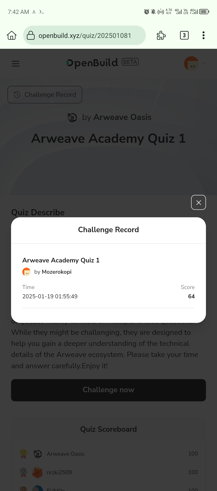
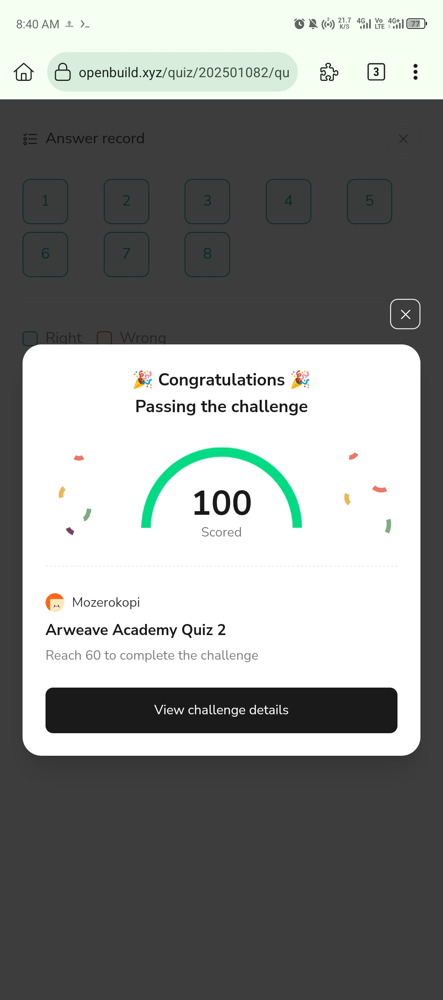
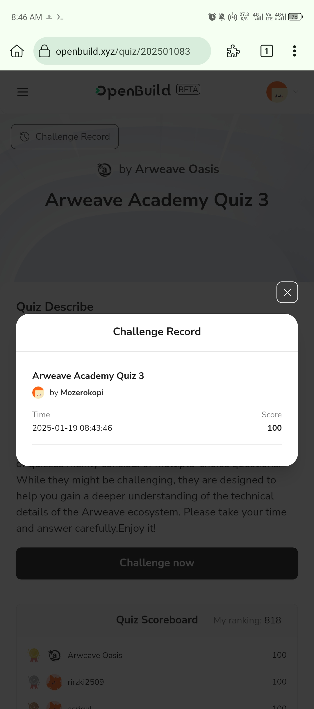
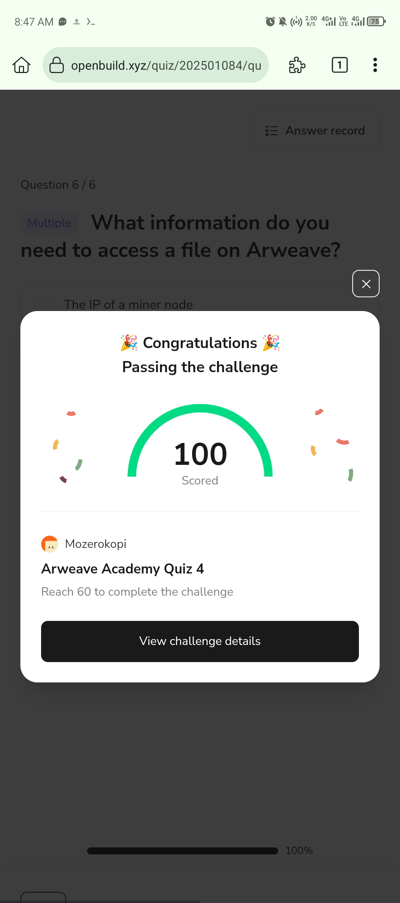
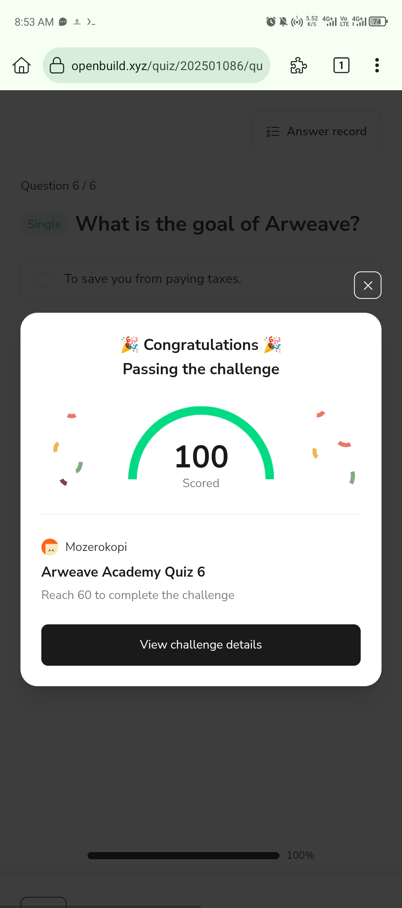
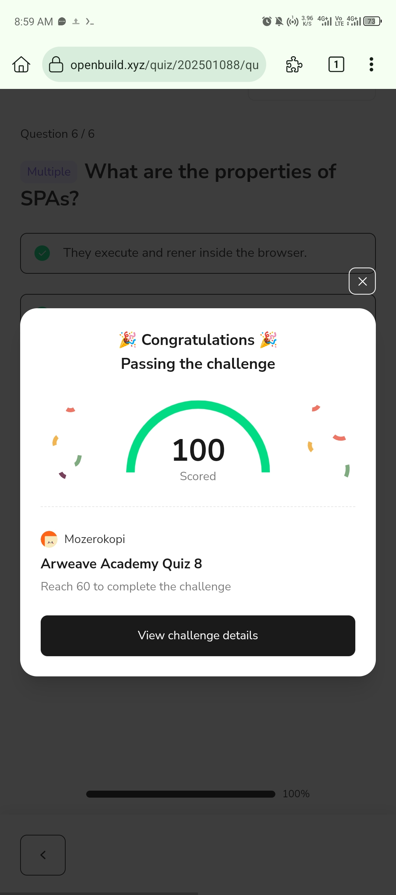
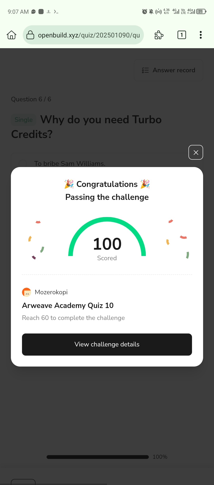

## Arweave Academy Personal File

Below is a screenshot showing the results of my assignment:

### Task 1:

### Task 2:

### Task 3:

### Task 4:

### Task 5:

### Task 6:

### Task 7:

### Task 8:

### Task 9:

### Task 10:

### Personal information

- github account: Mozerokopi
- Email: mozero6383@gmail.com
- Arweave Address: 60PCHBJfEQM9djIKNlTqwJcUK0zCCOcXbjMl_NakCJw
- ETH Address: 0xD818C5A91a3f9E3d22F1516566D7f921f426BCb2
- Please finish this [form](https://docs.google.com/forms/d/e/1FAIpQLSfWA5fIIcBgmRppm3jNz5vmf9Mai_QMVil-2pO4r7YKn_Zhtw/viewform?usp=sf_link) to join in the talent pool.

### Introduce Yourself
 i'am have biggest enthusiast in developing dApps in many chain in the web3 circle, im curently working a freelance in node developer, node runner, node operator etc
 
 
