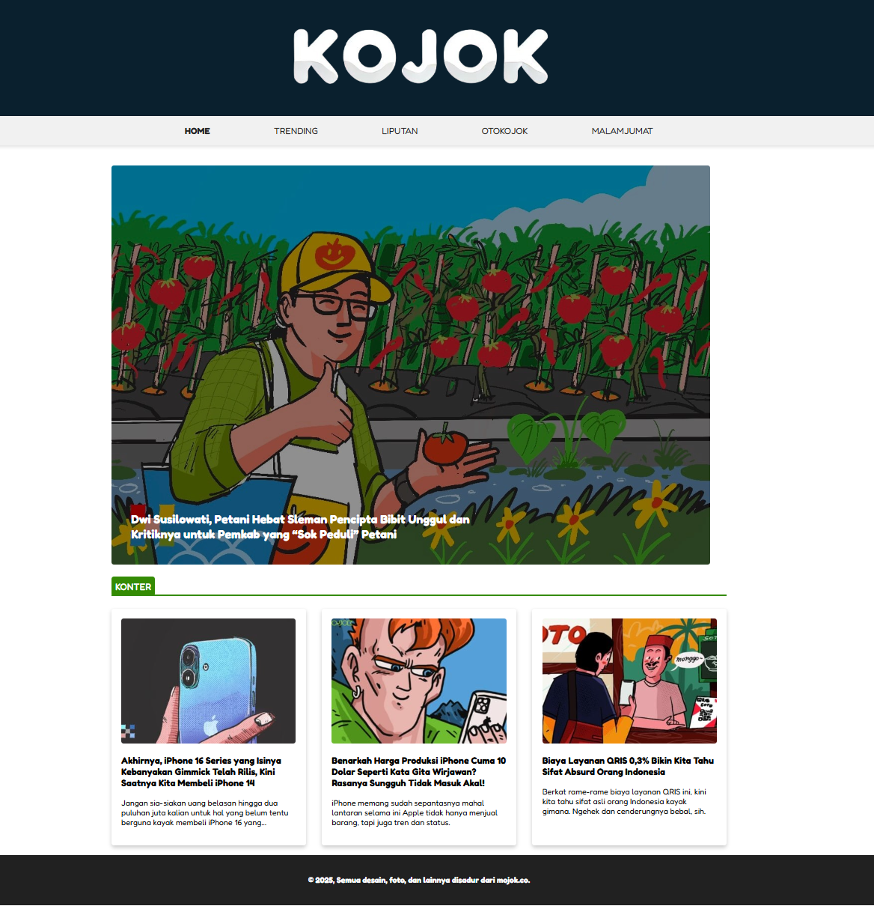
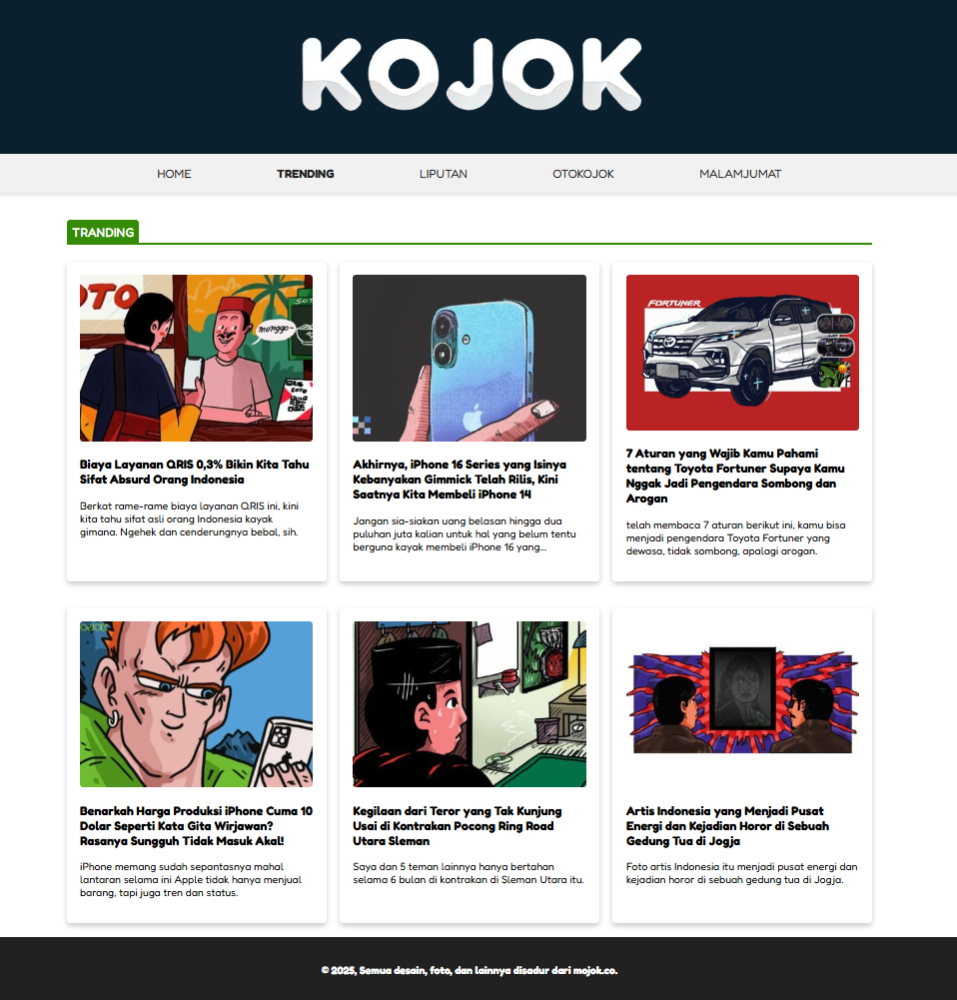
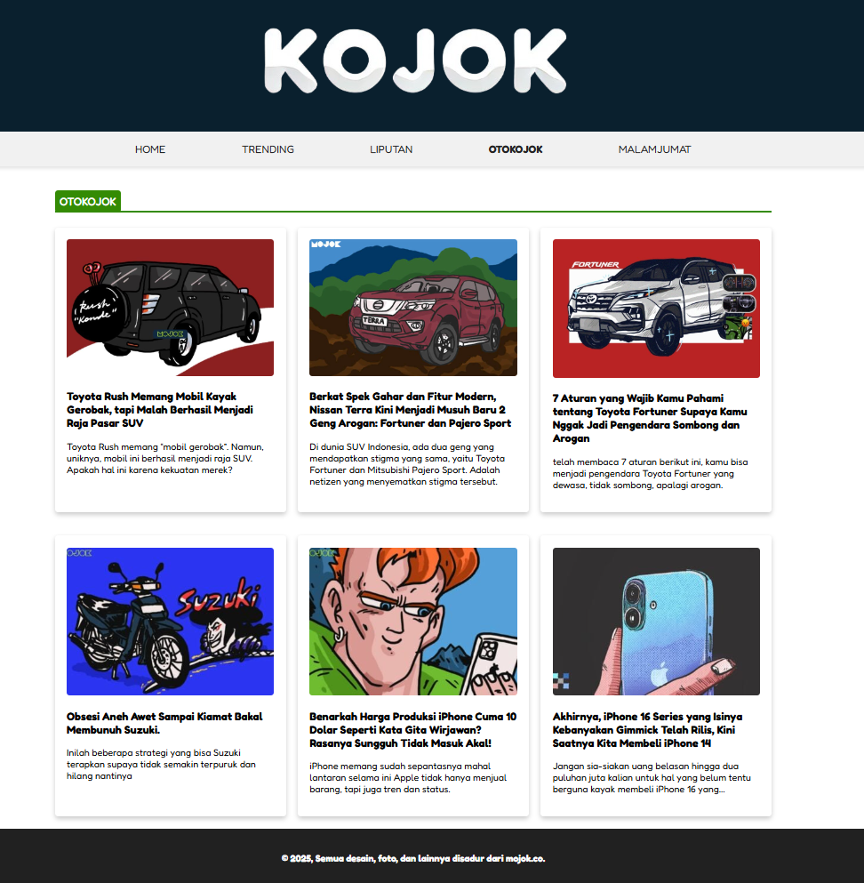
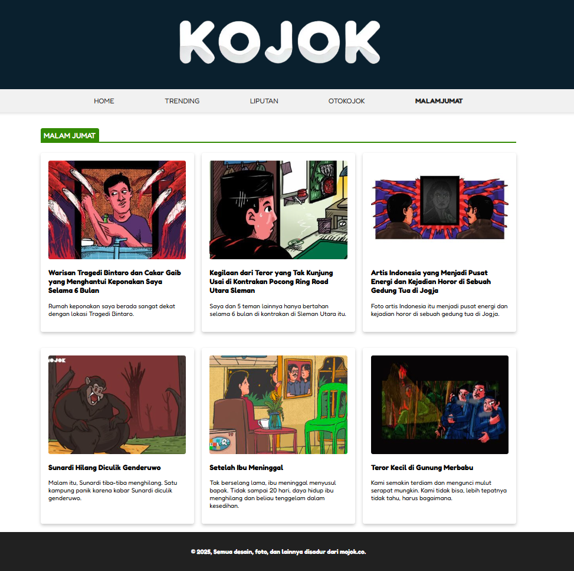

# Kojok Website

You can access this website at: [Kojok News](https://mydmv4b5rx6tlkygsn3udlf3zlsjvquz2dls7plhp23eswgnzveq.arweave.net/ZgbK8D2N_TWrBpN3Qay7yuSawpnQ1y-9Z362SVjNzUk/)

## Screenshots

## Description

Kojok is a simple and informative website that delivers a wide range of news articles, including trending topics, reviews, stories, and more. It's designed to keep users informed on various topics, ranging from technology to culture, all in an easily digestible format.

## Project Structure

- `assets/styles/style.css`: Styles for the website.
- `assets/images/`: Contains images used in the website, including the logo and article
- `assets/screenshoot/`: Contains screenshots of the website, such as the homepage, trending page, liputan page, malamjumat page & otokojok page.
- `src/trending.html`: Trending page, listing the latest trending articles.
- `src/liputan.html`: Liputan (coverage) page, dedicated to featured stories and reports.
- `src/otokojok.html`: A page focusing on automotive-related content.
- `src/malamjumat.html`: A special content section dedicated to horror-related stories and mysteries.
- `index.html`: The homepage of Kojok News, featuring featured articles and categories.

## Deploying to Dragondeploy

### 1. Preparing Your Project

before your deploy check your project, make sure you have the following files and folders in your project directory. after that
you can visiting the [Dragondeploy](https://dragondeploy.xyz/)

### 2. Connecting and Setting Permision Wallet

Before your upload file project you should configure permision.
you can visiting [Setting Permision](https://dragondeploy.xyz/pro-tips)

### 3. Uploading Your Files

Drag and drop your project folder directly into DragonDeploy and verification your project with your wallet. Press accept to confirm the project. and then when it is finished, a link will appear to access your project.

Good luck with your work, hope you succeed!!!
