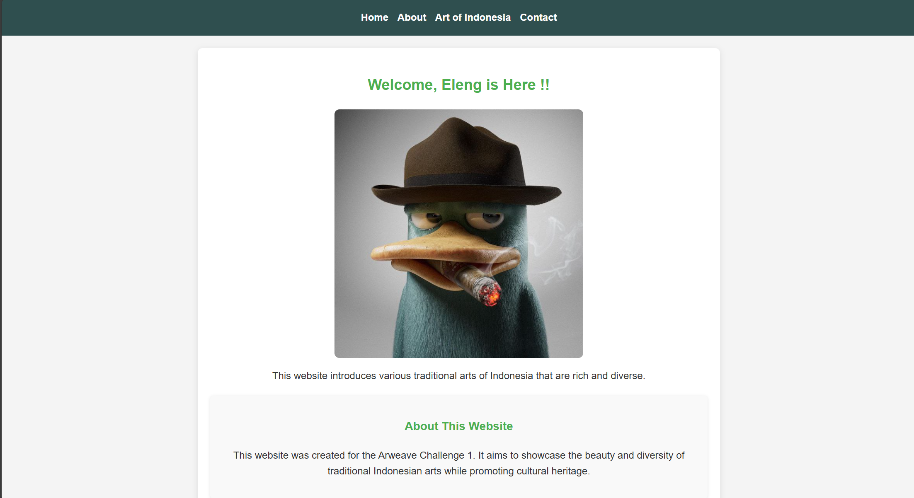
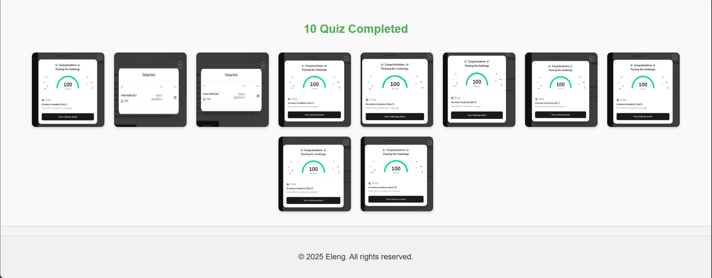
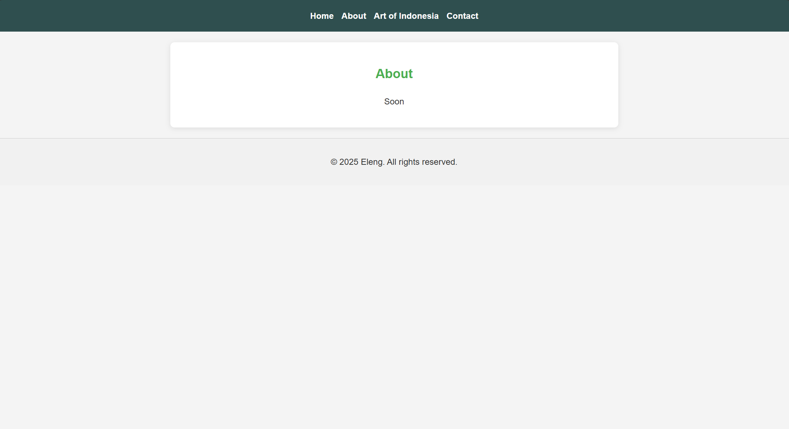
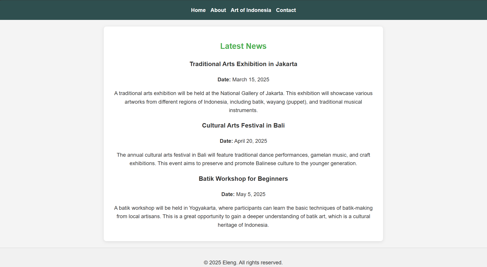
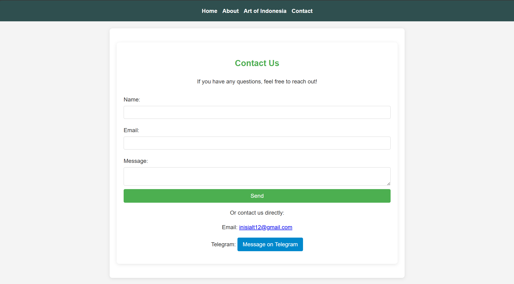

# Eleng Website

You can access this website it at:(https://bgluvfnujb3dmsxve4idtjoznvxznzfogwvv2cqod5qlfe3x4y2q.arweave.net/CZdKlbRIdjZK9ScQOaXZbW-W5K41q10KDh9gspN35jU/)

/project-directory
│
├── index.html                  # Main landing page (Home)
├── src/
│   ├── about.html              # About page
│   ├── artofindonesia.html     # Art of Indonesia page
│   └── contact.html            # Contact page
├── assets/
│   ├── css/
│   │   └── style.css           # Styles for the website
│   └── images/
│       ├── 0.jpg               # Banner image
│       ├── 1.png               # Gallery image 1
│       ├── 2.png               # Gallery image 2
│       ├── 3.png               # Gallery image 3
│       ├── 4.png               # Gallery image 4
│       ├── 5.png               # Gallery image 5
│   └── ss/                     
│       ├── ss1.png             # Screenshot image 1
│       ├── ss2.png             # Screenshot image 2
│       ├── ss3.png             # Screenshot image 3
│       ├── ss4.png             # Screenshot image 4
│       └── ss5.png             # Screenshot image 5
└── README.md                   # This file

# Acknowledgments
* This website was created for the Arweave Challenge 1 to showcase news about traditional Indonesian arts.
* Special thanks to BangPateng that teaching me for this website.

,,
,,

this website deploy use [Dragondeploy](https://dragondeploy.xyz/)

## Deploying to Dragondeploy

### 1. Preparing Your Project

before your deploy check your project, make sure you have the following files and folders in your project directory. after that
you can visiting the [Dragondeploy](https://dragondeploy.xyz/)

### 2. Connecting and Setting Permision Wallet

Before your upload file project you should configure permision.
you can visiting [Setting Permision](https://dragondeploy.xyz/pro-tips)

### 3. Uploading Your Files

Drag and drop your project folder directly into DragonDeploy and verification your project with your wallet. Press accept to confirm the project. and then when it is finished, a link will appear to access your project.
